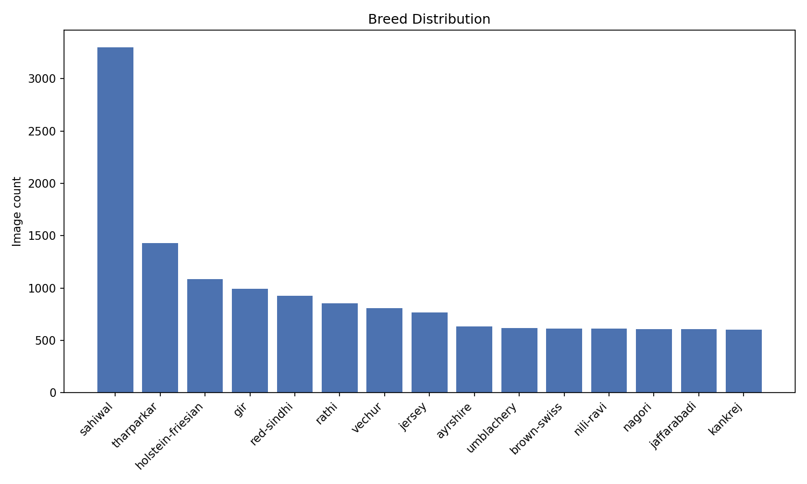
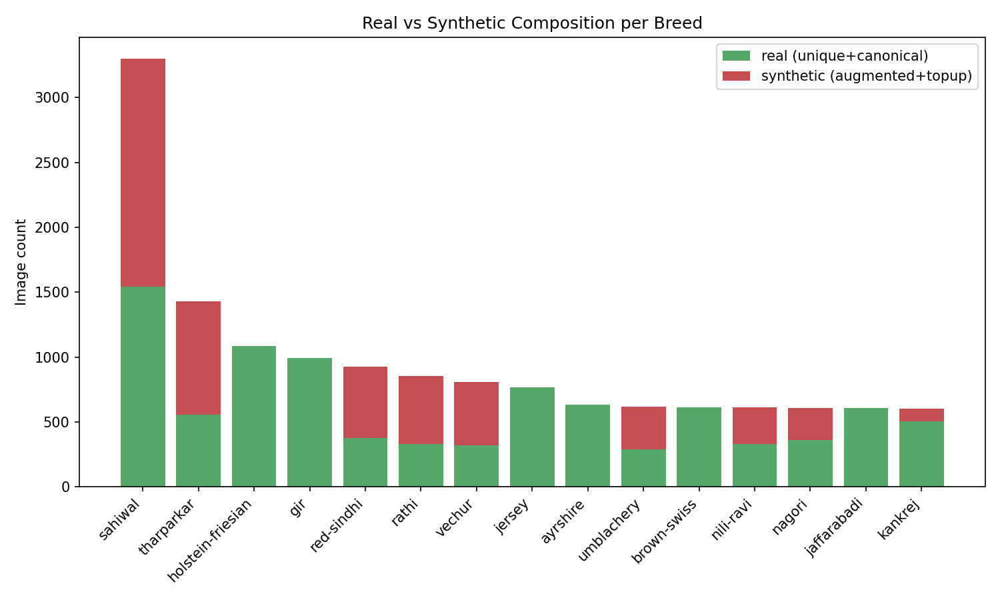
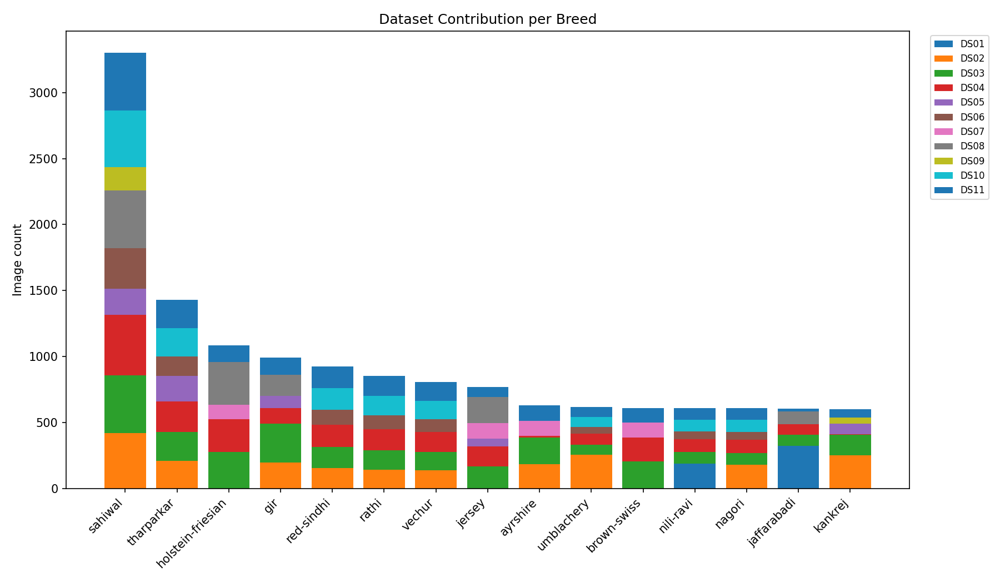
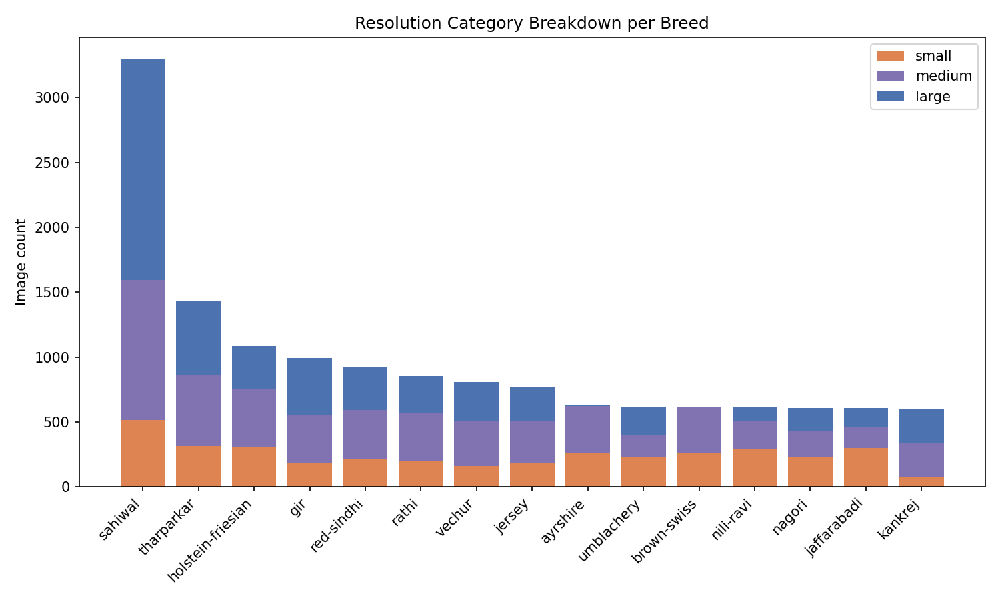
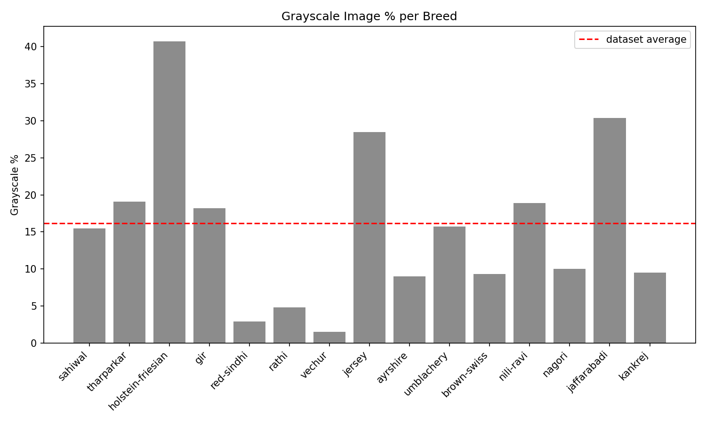

# 🐄 Indian Cattle & Buffalo Breeds (15-Class) Classification Dataset

[](https://www.kaggle.com/datasets/vedant0dusane/cattle-breed-classification-dataset)
[](https://creativecommons.org/licenses/by/4.0/)
[](https://opensource.org/licenses/MIT)
[](https://www.python.org/)
[](https://pytorch.org/)

A curated, deduplicated, zero-leakage benchmark image dataset containing **14,443 standardized images** across **15 Indian cattle and river buffalo breeds**, engineered and consolidated from **11 public source repositories**.

Designed for **centralized computer vision benchmarks** and **federated learning (FL) farm simulations**.

---

## 📌 Dataset Overview

* **Kaggle Dataset**: [vedant0dusane/cattle-breed-classification-dataset](https://www.kaggle.com/datasets/vedant0dusane/cattle-breed-classification-dataset)
* **Total Images**: `14,443`
* **Total Classes**: `15` (12 Cattle breeds + 3 Buffalo breeds)
* **Public Datasets Merged**: `11`
* **Evaluation Integrity**: **Zero Data Leakage** guaranteed between Train, Validation, and Test sets via cluster-aware stratification.

---

## 🐂 Breeds & Real vs. Synthetic Breakdown

| **Breed**             | **Species / Type**     | **Total Images** | **Real Images** | **Synthetic / Augmented** | **Real %** |
| :-------------------- | :--------------------- | ---------------: | --------------: | ------------------------: | ---------: |
| **Sahiwal**           | Zebu / Dairy           |            3,300 |           1,540 |                     1,760 |      46.7% |
| **Tharparkar**        | Zebu / Dual Purpose    |            1,428 |             555 |                       873 |      38.9% |
| **Holstein-Friesian** | Taurine / Dairy        |            1,085 |           1,085 |                         0 |     100.0% |
| **Gir**               | Zebu / Dairy           |              993 |             993 |                         0 |     100.0% |
| **Red-Sindhi**        | Zebu / Dairy           |              926 |             375 |                       551 |      40.5% |
| **Rathi**             | Zebu / Dual Purpose    |              853 |             330 |                       523 |      38.7% |
| **Vechur**            | Miniature Zebu         |              806 |             318 |                       488 |      39.5% |
| **Jersey**            | Taurine / Dairy        |              768 |             768 |                         0 |     100.0% |
| **Ayrshire**          | Taurine / Dairy        |              631 |             631 |                         0 |     100.0% |
| **Umblachery**        | Draft Zebu             |              618 |             287 |                       331 |      46.4% |
| **Brown-Swiss**       | Taurine / Dual Purpose |              611 |             611 |                         0 |     100.0% |
| **Nagori**            | Draft Zebu             |              608 |             359 |                       249 |      59.0% |
| **Nili-Ravi**         | River Buffalo          |              610 |             329 |                       281 |      53.9% |
| **Jaffarabadi**       | River Buffalo          |              606 |             606 |                         0 |     100.0% |
| **Kankrej**           | Zebu / Dual Purpose    |              600 |             503 |                        97 |      83.8% |
| **Total**             |                        |       **14,443** |       **8,956** |                 **5,487** |  **62.0%** |

---

## 📊 Exploratory Data Analysis & Visualizations

The dataset was comprehensively audited for multi-source balance, image resolutions, color channel distributions, and duplicate cluster sizes.

### 1. Breed Distribution & Real vs. Synthetic Composition





### 2. Multi-Dataset Source Contributions & Image Resolutions





### 3. Grayscale Concentration by Breed



---

## 🔬 The 9-Stage Curation Pipeline

All data processing scripts used to construct this dataset are available in [`Master-Dataset/Scripts/`](./Master-Dataset/Scripts/).

### 1. `01_scan_datasets.py`

Inventories **11 public source datasets** and establishes a unified naming taxonomy.

### 2. `02_merge_datasets.py`

Consolidates raw images into standardized staging directories.

### 3. `03_validate_images.py`

Verifies image headers, corrupt files, and invalid formats.

### 4. `04_remove_duplicates.py`

Performs multi-hash perceptual deduplication using:

* pHash
* dHash
* aHash
* wHash

It also performs duplicate cluster grouping.

### 5. `04a_verify_cross_breed_collisions.py`

Cross-references image hashes across breeds using **SSIM/MD5** to quarantine mislabeled samples.

### 6. `04b_finalize_breed_selection.py`

Selects the top **15 breeds** meeting the representation threshold and performs controlled top-up augmentation where necessary.

### 7. `05_generate_metadata.py`

Generates full image metadata in `master_metadata.csv`, including:

* Image dimensions
* Color spaces
* Image origins

### 8. `06_dataset_statistics.py` & `06a_verify_grayscale.py`

Computes:

* EDA metrics
* Grayscale percentages
* Resolution tiers

### 9. `07_split_dataset.py` & `07a_fix_leakage_violations.py`

Performs **Cluster-Aware Stratified Splitting** across:

* Train
* Validation
* Test

Duplicate clusters and augmented siblings are locked to the same split, guaranteeing **zero data leakage**.

### 10. `08_generate_clients.py`

Partitions the `train/` dataset into simulated **Dirichlet Non-IID client nodes** for federated learning.

---

## 📁 Repository Directory Structure

```text
cattle-breed-classification-dataset/
│
├── Master-Dataset/
│   ├── master_dataset/
│   │   ├── train/                         # 15 breed subfolders (Train set)
│   │   ├── val/                           # 15 breed subfolders (Validation set)
│   │   ├── test/                          # 15 breed subfolders (Test set)
│   │   ├── clients/                        # Federated client partitions
│   │   ├── split_manifest.csv             # Unified image split manifest
│   │   └── generate_clients.py            # Client partition generator
│   │
│   ├── Scripts/                            # 9-stage data engineering pipeline
│   │   ├── 01_scan_datasets.py
│   │   ├── 02_merge_datasets.py
│   │   ├── 03_validate_images.py
│   │   ├── 04_remove_duplicates.py
│   │   ├── 04a_verify_cross_breed_collisions.py
│   │   ├── 04b_finalize_breed_selection.py
│   │   ├── 05_generate_metadata.py
│   │   ├── 06_dataset_statistics.py
│   │   ├── 06a_verify_grayscale.py
│   │   ├── 07_split_dataset.py
│   │   ├── 07a_fix_leakage_violations.py
│   │   └── 08_generate_clients.py
│   │
│   ├── statistics/
│   │   ├── charts/                        # High-resolution EDA figures
│   │   ├── dataset_health_report.md
│   │   └── dataset_statistics.json
│   │
│   ├── master_metadata.csv                # Full metadata (resolution, mode, source)
│   ├── final_15breed_manifest.csv         # Manifest of 15 selected classes
│   ├── duplicate_clusters.csv             # Perceptual hash cluster log
│   └── split_manifest.csv                 # Leakage-safe split manifest
│
├── dataset_loader.py                       # PyTorch Dataset and DataLoader module
├── download_dataset.py                     # 1-command Kaggle downloader
├── requirements.txt                        # Python dependencies
├── CITATION.cff                            # Citation metadata
├── LICENSE                                 # CC-BY-4.0 & MIT License
└── README.md
```

---

## 🚀 Quick Start

### 1. Installation

Clone the repository and install the required dependencies:

```bash
git clone https://github.com/vedant0dusane/cattle-breed-classification-dataset.git

cd cattle-breed-classification-dataset

pip install -r requirements.txt
```

### 2. Download Dataset from Kaggle

#### Automated downloader script — Recommended

```bash
python download_dataset.py
```

#### Or via Kaggle CLI

```bash
kaggle datasets download \
  -d vedant0dusane/cattle-breed-classification-dataset \
  --unzip \
  -p Master-Dataset/master_dataset
```

---

### 3. Load with PyTorch

```python
from torch.utils.data import DataLoader

from dataset_loader import CattleBreedDataset, get_default_transforms

# Standard ImageNet augmentations
train_transform, val_transform = get_default_transforms(img_size=224)

# Create Datasets
train_set = CattleBreedDataset(
    split="train",
    transform=train_transform
)

val_set = CattleBreedDataset(
    split="val",
    transform=val_transform
)

test_set = CattleBreedDataset(
    split="test",
    transform=val_transform
)

# Create DataLoaders
train_loader = DataLoader(
    train_set,
    batch_size=32,
    shuffle=True,
    num_workers=4
)

val_loader = DataLoader(
    val_set,
    batch_size=32,
    shuffle=False
)

print(f"Breeds ({len(train_set.classes)}): {train_set.classes}")
print(f"Train: {len(train_set)}, Val: {len(val_set)}, Test: {len(test_set)}")
```

---

### 4. Federated Learning Farm Simulation

Navigate to the master dataset directory:

```bash
cd Master-Dataset/master_dataset

python generate_clients.py
```

The client-generation process:

* Simulates a **Non-IID Dirichlet distribution** with `α = 0.5` across `N` client farms.
* Only partitions the `train/` dataset.
* Keeps `val/` and `test/` centralized for unbiased global evaluation.

---

## 🧪 Intended Use Cases

This dataset is designed to support:

### Centralized Computer Vision

Benchmark image classification models across **15 cattle and river buffalo breed classes** using a standardized and leakage-safe dataset.

### Federated Learning

Simulate distributed farm environments through Non-IID client partitions generated using a **Dirichlet distribution (`α = 0.5`)**.

### Dataset Engineering Research

Study:

* Multi-source dataset consolidation
* Perceptual deduplication
* Cross-breed collision detection
* Cluster-aware dataset splitting
* Synthetic/augmented data composition
* Image-resolution variation
* Grayscale image concentration
* Federated Non-IID data distributions

---

## 🔒 Data Leakage Prevention

A key design objective of this dataset is maintaining evaluation integrity.

The Train, Validation, and Test sets are generated using **cluster-aware stratification**.

Duplicate images and their augmented/synthetic siblings are treated as members of the same cluster. These clusters are locked to a single dataset split rather than being independently distributed across Train, Validation, and Test.

This prevents near-identical images or augmented versions of the same source image from appearing in multiple evaluation splits.

The pipeline includes dedicated validation and correction stages:

```text
04_remove_duplicates.py
        ↓
04a_verify_cross_breed_collisions.py
        ↓
07_split_dataset.py
        ↓
07a_fix_leakage_violations.py
```

The resulting dataset is designed to provide **zero data leakage** between Train, Validation, and Test sets.

---

## 🌐 Federated Learning Setup

The dataset includes support for simulated federated farm environments.

The `generate_clients.py` utility partitions only the training data into multiple client nodes using a **Dirichlet Non-IID distribution**.

```text
                    Master Training Set
                            │
                            ▼
                 Dirichlet α = 0.5
                            │
             ┌──────────────┼──────────────┐
             ▼              ▼              ▼
          Farm 1          Farm 2          Farm N
          Client          Client          Client
             │              │              │
             └──────────────┼──────────────┘
                            ▼
                    Federated Training
                            │
                            ▼
                 Centralized Validation
                       & Test Sets
```

The centralized validation and test sets remain untouched by client partitioning to provide unbiased global evaluation.

---

## 📜 Citation

If you use this dataset in research, benchmarking, projects, or publications, please cite:

```bibtex
@misc{dusane2026cattle,
  author = {Vedant Dusane},
  title = {Indian Cattle \& Buffalo Breeds (15-Class) Classification Dataset},
  year = {2026},
  publisher = {Kaggle},
  howpublished = {\url{https://www.kaggle.com/datasets/vedant0dusane/cattle-breed-classification-dataset}},
  note = {Curated Zero-Leakage Dataset for Centralized and Federated Image Classification}
}
```

---

## 📄 License

### Dataset & Manifests

The dataset and associated manifests are released under the:

**Creative Commons Attribution 4.0 International (CC BY 4.0)**

[View CC BY 4.0 License](https://creativecommons.org/licenses/by/4.0/)

### Code & Pipeline Scripts

The code, data-processing scripts, and associated software components are released under the:

**MIT License**

[View MIT License](https://opensource.org/licenses/MIT)

---

## 🔗 Dataset & Repository

* **Kaggle Dataset:** [vedant0dusane/cattle-breed-classification-dataset](https://www.kaggle.com/datasets/vedant0dusane/cattle-breed-classification-dataset)
* **GitHub Repository:** [vedant0dusane/cattle-breed-classification-dataset](https://github.com/vedant0dusane/cattle-breed-classification-dataset)

---

## ⭐ Acknowledgement

This dataset consolidates and standardizes images from **11 public source repositories** into a unified **15-class Indian cattle and river buffalo breed classification benchmark**, with an emphasis on deduplication, metadata auditing, leakage-safe evaluation, and federated learning simulation.
